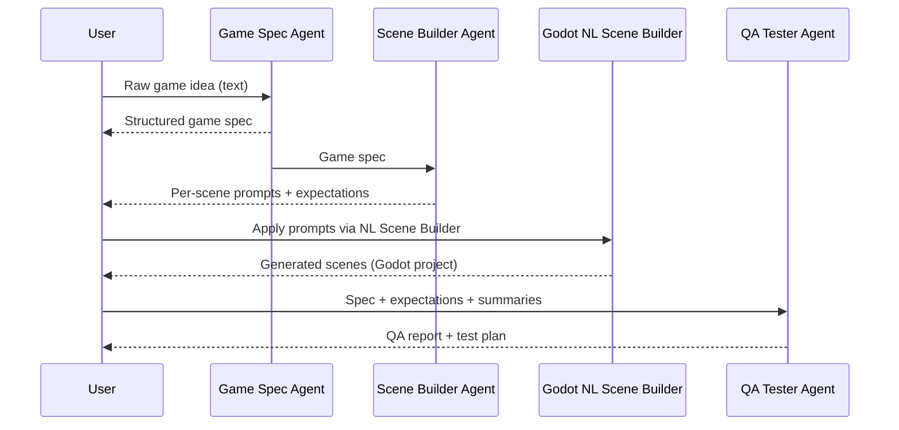

# Multi-Agent Pipeline for One‑Shot 2D Game Generation

This document outlines a lightweight, multi‑agent workflow for turning a single
natural language idea into a small 2D Godot game using the NL Scene Builder
plugin and surrounding tools. It is intentionally high‑level; detailed schemas
and prompts are defined in follow‑up docs.

The core idea is:

> **One prompt in → Game Spec Agent → Scene Builder Agent → Godot editor (NL Scene Builder) → QA Tester Agent → reports out.**

The pipeline is designed to be orchestrated by a small CLI tool or Task Master
workflow so you can “one‑shot” a simple 2D prototype, then iterate.

---

## Agent Roles (High‑Level)

### 1. Game Spec Agent

**Purpose:** Turn a raw natural language idea into a structured 2D game spec.

- **Input:** A short free‑form idea, e.g.  
  `"a simple top‑down shooter with waves of enemies and a score counter"`.
- **Output:** A structured game description (e.g. JSON or Markdown) capturing:
  - Title and elevator pitch.
  - Genre and core loop.
  - Player entity (abilities, controls, health).
  - Enemies/hazards and basic behaviours.
  - Levels/scenes (e.g. main menu, level 1, game‑over screen).
  - Win/lose conditions.
  - UI elements (health bar, score, basic HUD).
- **Scope constraints:**
  - 2D only, using common Godot 4 nodes and GDScript.
  - No advanced animation, 3D, or custom assets.

Artifacts (proposed):

- `docs/artifacts/game_specs/<slug>.json` or `.md`

### 2. Scene Builder Agent

**Purpose:** Convert the game spec into per‑scene generation prompts for the
NL Scene Builder editor panel, and derive simple expectations for each scene.

- **Input:**
  - Game spec from Game Spec Agent.
- **Output:**
  - A list of **per‑scene prompts** that can be pasted or scripted into the
    NL Scene Builder panel, e.g.:
    - `main_menu.prompt.txt`
    - `level_1.prompt.txt`
    - `game_over.prompt.txt`
  - For each scene, a **checklist of expected content**, such as:
    - Required nodes (Player, Enemy spawners, UI nodes).
    - Key behaviours (player movement, enemy spawning, score updates).
    - Signals or interactions (e.g. Area2D pickup, button pressed).

Artifacts (proposed):

- `docs/artifacts/scene_prompts/<game_slug>/main_menu.prompt.md`
- `docs/artifacts/scene_expectations/<game_slug>/level_1.checklist.md`

### 3. QA Tester Agent

**Purpose:** Use the game spec and scene expectations to propose tests and
evaluate the generated game at a structural/behavioural level.

- **Input:**
  - Game spec.
  - Per‑scene expectations (from Scene Builder Agent).
  - Optionally: summary of what was actually generated (e.g. node listings).
- **Output:**
  - A **QA report** describing:
    - Structural checks (nodes, signals, scripts present/missing).
    - Basic behavioural assumptions (player can move, enemies spawn, score changes).
    - UI checks (health/score visible and updating).
    - Severity and recommendations for iteration.
  - A simple **test plan**: a small set of manual or automated checks to run.

Artifacts (proposed):

- `docs/artifacts/qa_reports/<game_slug>.md`

### 4. (Optional) Cross‑Checker Agent

**Purpose:** Cross‑compare the outputs of the other agents and flag drift or
inconsistencies, for example:

- Scene prompts that ignore parts of the spec.
- Generated scenes that miss critical spec requirements.
- QA findings that suggest spec or prompts are underspecified.

This can often be folded into the QA Tester Agent, but is listed separately as
a possible future refinement.

---

## Artifacts and Repo Layout

Suggested locations for pipeline artifacts (all are proposals, not yet binding):

- Game specs:
  - `docs/artifacts/game_specs/<game_slug>.json` or `.md`
- Scene prompts:
  - `docs/artifacts/scene_prompts/<game_slug>/<scene_name>.prompt.md`
- Scene expectations/checklists:
  - `docs/artifacts/scene_expectations/<game_slug>/<scene_name>.checklist.md`
- QA reports:
  - `docs/artifacts/qa_reports/<game_slug>.md`

These paths make it easy for a CLI orchestrator and Task Master tasks to
discover and reuse previous generations.

---

## One‑Shot Generation Flow

At a high level, a one‑shot run for a new game idea looks like this:

1. **User prompt → Game Spec Agent**
   - User provides a short description:  
     `"2D platformer with a player that can jump on enemies and collect coins; one level and a simple HUD."`
   - Game Spec Agent produces `game_specs/platformer_coins.json`.

2. **Game Spec → Scene Builder Agent**
   - Scene Builder Agent reads the spec and decides which scenes to create
     (e.g. `main_menu`, `level_1`, `game_over`).
   - It emits:
     - Per‑scene prompts (for NL Scene Builder).
     - Per‑scene expectation checklists.

3. **Scene Builder prompts → Godot NL Scene Builder**
   - Either manually (copy/paste) or via a script, the per‑scene prompts are
     sent into the NL Scene Builder dock in the editor.
   - The plugin talks to the chosen LLM and generates/updates scenes.

4. **Generated scenes → QA Tester Agent**
   - Once scenes exist, a simple representation of what was generated is
     collected (e.g. node tree dumps, script summaries).
   - QA Tester Agent consumes:
     - The original game spec.
     - The expectation checklists.
     - The generated scene summaries.
   - It outputs a QA report and test plan.

5. **Feedback and iteration (optional)**
   - If QA flags major gaps (e.g. no enemies in level 1), the orchestrator
     can:
     - Ask the Scene Builder Agent for a revised prompt, or
     - Send a clarification back to the Game Spec Agent to refine the spec.

---

## Sequence Diagram (Conceptual)

In Mermaid‑style pseudocode:

This diagram omits the optional Cross‑Checker and orchestrator process, which
will be defined separately in `docs/nl_game_orchestrator.md`.

---

## Next Steps (Follow‑Up Tasks)

The following tasks refine and implement pieces of this pipeline:

- **Game Spec Agent & schema** – define concrete fields and example specs.
- **Scene Builder Agent strategy** – map specs to realistic NL prompts and
  expectations aligned with the NL Scene Builder’s capabilities.
- **QA Tester Agent** – design specific checks, report templates, and a path
  toward automated or semi‑automated tests.
- **Orchestration script** – a small CLI that runs these agents in sequence,
  drives Godot where possible, and writes artifacts to the paths above.

This document is only the top‑level map those tasks plug into.

